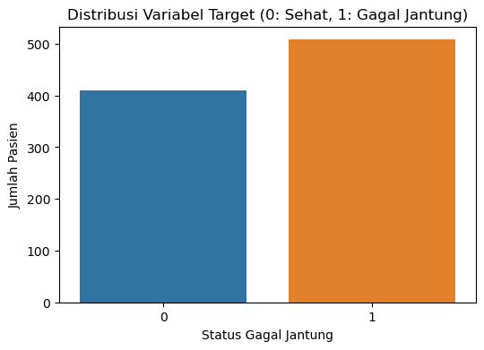
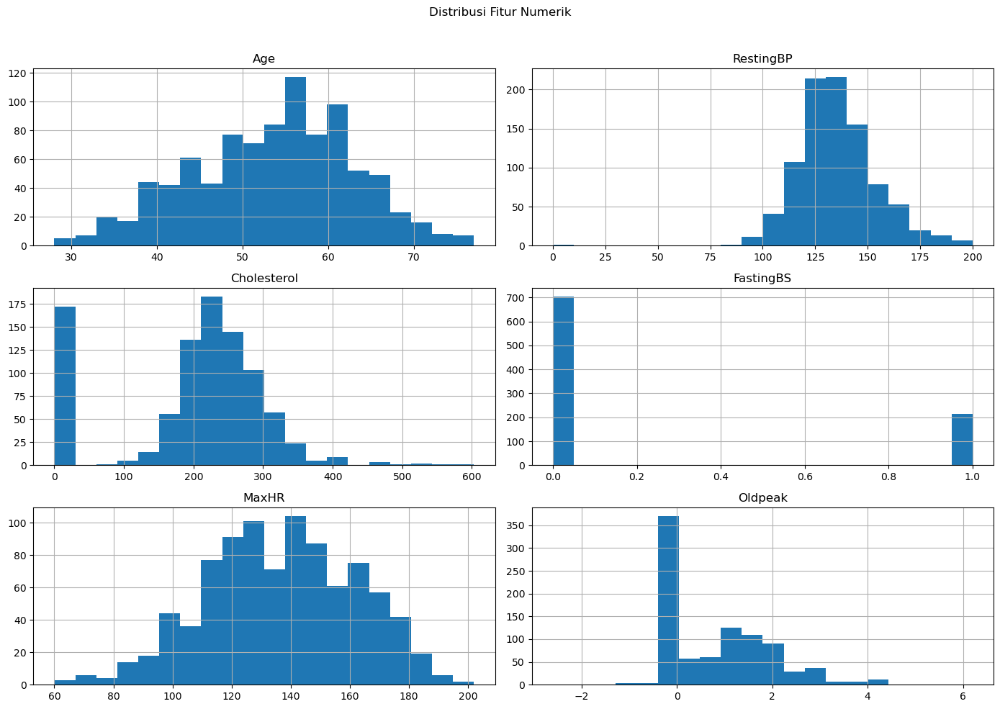
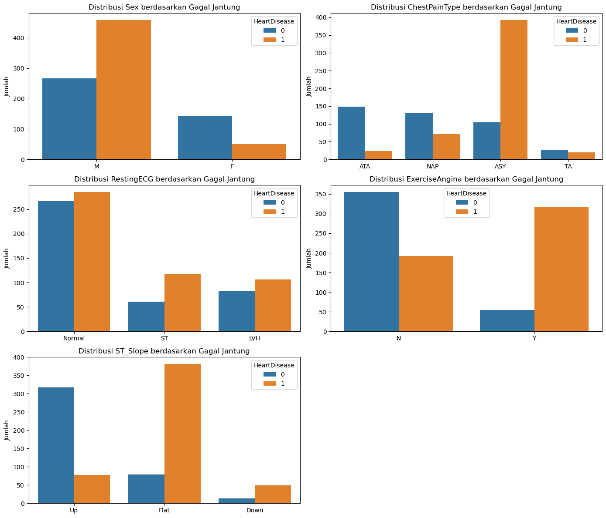
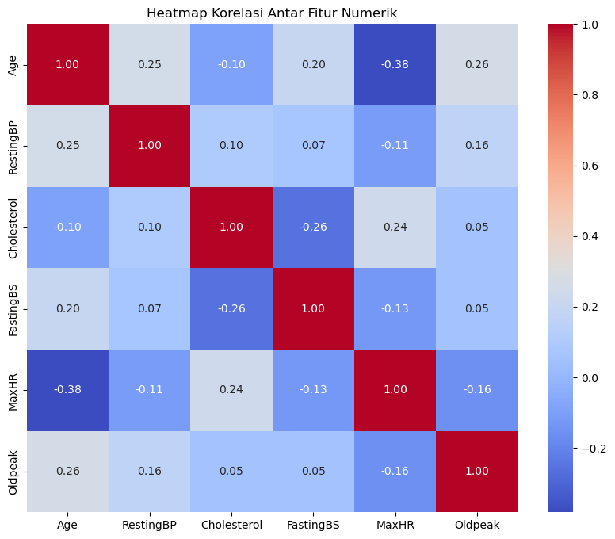
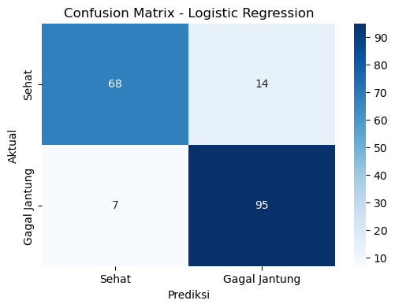
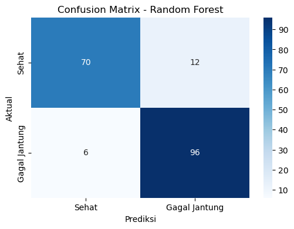

# Laporan Proyek Machine Learning - Muhammad Husain Fadhlillah

## Ringkasan Proyek

- **Nama:** Muhammad Husain Fadhlillah
- **Email Student:** mc006d5y2343@student.devacademy.id
- **Cohort ID:** MC006D5Y2343

Proyek ini bertujuan untuk membangun model machine learning yang dapat memprediksi risiko penyakit jantung pada pasien berdasarkan data klinis dan demografis. Dengan menggunakan pendekatan klasifikasi, proyek ini membandingkan performa dua model, yaitu _Logistic Regression_ dan _Random Forest_, untuk menemukan solusi prediksi yang paling akurat dan andal. Proyek ini juga mencakup tahapan _data cleaning_, _exploratory data analysis_ (EDA), dan optimisasi model melalui _hyperparameter tuning_ untuk memastikan hasil yang optimal.

## Domain Proyek

Penyakit kardiovaskular (CVDs), termasuk gagal jantung, merupakan penyebab utama kematian secara global. Menurut Organisasi Kesehatan Dunia (WHO), penyakit ini merenggut sekitar 17,9 juta nyawa setiap tahunnya, atau sekitar 32% dari seluruh kematian global [1]. Deteksi dini dan diagnosis yang akurat memegang peranan krusial dalam manajemen penyakit jantung, yang dapat secara signifikan meningkatkan peluang keberhasilan pengobatan dan menyelamatkan nyawa.

**Mengapa dan Bagaimana Masalah Ini Harus Diselesaikan?**
Secara tradisional, diagnosis penyakit jantung memerlukan serangkaian tes yang kompleks, mahal, dan memakan waktu. Terdapat kebutuhan mendesak untuk alat bantu diagnosis yang lebih cepat, efisien, dan dapat diakses. Model machine learning dapat menganalisis pola tersembunyi dari data pasien yang mungkin sulit diidentifikasi oleh manusia. Dengan adanya model prediksi yang andal, tenaga medis dapat:

1.  Melakukan skrining awal dengan lebih cepat untuk mengidentifikasi pasien berisiko tinggi.
2.  Memprioritaskan pasien yang memerlukan perhatian medis lebih lanjut.
3.  Membantu dalam pengambilan keputusan klinis sebagai alat bantu diagnosis (bukan pengganti).

Solusi ini dapat mengurangi beban sistem kesehatan, menekan biaya diagnosis, dan yang terpenting, mempercepat intervensi medis bagi mereka yang paling membutuhkan.

**Referensi:**
[1] World Health Organization (WHO). (2021, June 11). _Cardiovascular diseases (CVDs)_. WHO. https://www.who.int/news-room/fact-sheets/detail/cardiovascular-diseases-(cvds)
[2] Fedesoriano. (2021). _Heart Failure Prediction Dataset_. Kaggle. https://www.kaggle.com/datasets/fedesoriano/heart-failure-prediction

---

## Business Understanding

### Problem Statements

Berdasarkan latar belakang yang telah diuraikan, masalah yang ingin diselesaikan dirumuskan sebagai berikut:

- Bagaimana cara membangun sebuah model klasifikasi yang akurat untuk memprediksi risiko gagal jantung pada pasien berdasarkan data klinis yang tersedia?
- Algoritma mana, antara model linear (Logistic Regression) dan model berbasis _ensemble_ (Random Forest), yang memberikan performa prediksi terbaik untuk kasus ini?
- Bagaimana cara mengoptimalkan _hyperparameter_ dari model yang lebih kompleks untuk meningkatkan performanya lebih lanjut?

### Goals

Tujuan dari proyek ini adalah:

- Menghasilkan model klasifikasi yang mampu memprediksi keberadaan penyakit jantung dengan metrik **F1-Score di atas 85%**, untuk memastikan keseimbangan antara presisi dan recall dalam konteks medis.
- Membandingkan performa antara model Logistic Regression sebagai _baseline_ dengan model Random Forest yang telah dioptimalkan.
- Mengidentifikasi kombinasi _hyperparameter_ terbaik untuk model Random Forest guna memaksimalkan kinerjanya.

### Solution Statements

Untuk mencapai tujuan tersebut, strategi yang diusulkan adalah sebagai berikut:

1.  **Mengembangkan model _baseline_** menggunakan algoritma **Logistic Regression**. Model ini dipilih karena kesederhanaannya dan kemampuannya memberikan dasar performa yang solid dan mudah diinterpretasikan.
2.  **Mengembangkan model yang lebih kompleks** menggunakan algoritma **Random Forest**, yang diharapkan mampu menangkap pola data yang lebih rumit.
3.  **Melakukan _improvement_** pada model Random Forest dengan teknik **Hyperparameter Tuning menggunakan GridSearchCV**. Ini dilakukan untuk mencari kombinasi parameter terbaik secara sistematis dan meningkatkan performa prediktif model.
4.  **Membandingkan** kedua model final (Logistic Regression dan Random Forest yang telah di-tuning) menggunakan metrik F1-Score sebagai metrik utama untuk memilih model terbaik sebagai solusi akhir.

---

## Data Understanding

### Sumber Data

Dataset yang digunakan adalah "Heart Failure Prediction" yang bersumber dari Kaggle. Dataset ini berisi 918 sampel data pasien dengan 11 fitur prediktor dan 1 variabel target. Dataset ini merupakan kompilasi dari beberapa dataset lain yang ditujukan untuk memprediksi penyakit jantung.

- **Tautan Dataset:** [Heart Failure Prediction Dataset](https://www.kaggle.com/datasets/fedesoriano/heart-failure-prediction)

### Inspeksi Awal Data

- **Struktur Data:**
  - Dataset ini terdiri dari **918 sampel** dan **12 kolom** (11 fitur prediktor dan 1 variabel target `HeartDisease`).
  - Tipe data dalam dataset ini bervariasi, mencakup `int64`, `float64`, dan `object`, yang menandakan adanya campuran fitur numerik dan kategorikal.
- **Kualitas Data:**
  - Berdasarkan pemeriksaan awal menggunakan `df.info()`, **tidak ditemukan nilai yang hilang (_missing values_)** pada dataset ini, karena semua kolom memiliki 918 entri non-null.
  - Pemeriksaan data duplikat juga menunjukkan bahwa **tidak ada baris duplikat** dalam dataset.
  - Meskipun tidak ada nilai null, teridentifikasi adanya anomali data pada fitur `RestingBP` dan `Cholesterol`, di mana nilai minimumnya adalah 0. Secara medis, nilai ini tidak mungkin terjadi pada pasien hidup dan kemungkinan besar merupakan _data entry error_ atau cara untuk merepresentasikan data yang hilang pada sumber aslinya.
- **Statistik Deskriptif:**
  - Rentang nilai antar fitur numerik sangat bervariasi. Sebagai contoh, `Cholesterol` memiliki nilai maksimum hingga 603, `MaxHR` hingga 202, sementara `Oldpeak` hanya 6.2.
  - Variasi skala yang signifikan ini mengindikasikan bahwa **penskalaan fitur (_feature scaling_)** akan menjadi langkah yang sangat penting pada tahap _Data Preparation_ untuk memastikan model (terutama model linear seperti Logistic Regression) tidak bias terhadap fitur dengan rentang nilai yang lebih besar.

### Variabel-variabel pada Dataset

Berikut adalah penjelasan untuk setiap variabel (fitur) dalam dataset:

- **Age:** Usia pasien (tahun).
- **Sex:** Jenis kelamin pasien (M: Pria, F: Wanita).
- **ChestPainType:** Tipe nyeri dada (TA: Typical Angina, ATA: Atypical Angina, NAP: Non-Anginal Pain, ASY: Asymptomatic).
- **RestingBP:** Tekanan darah saat istirahat (mm Hg).
- **Cholesterol:** Kolesterol serum (mm/dl).
- **FastingBS:** Gula darah puasa > 120 mg/dl (1: Ya, 0: Tidak).
- **RestingECG:** Hasil elektrokardiografi istirahat (Normal, ST, LVH).
- **MaxHR:** Denyut jantung maksimum yang dicapai.
- **ExerciseAngina:** Angina yang diinduksi oleh latihan (Y: Ya, N: Tidak).
- **Oldpeak:** Depresi ST yang diinduksi oleh latihan.
- **ST_Slope:** Kemiringan segmen ST saat latihan puncak (Up, Flat, Down).
- **HeartDisease (Target):** Diagnosis penyakit jantung (1: Ya, 0: Tidak).

### Exploratory Data Analysis (EDA)

EDA dilakukan untuk mendapatkan wawasan awal dari data.

- **Distribusi Target:**
  Dataset menunjukkan distribusi kelas yang cukup seimbang, dengan **508 pasien (55%)** didiagnosis menderita penyakit jantung dan **410 pasien (45%)** sehat. Hal ini mengindikasikan bahwa Akurasi bisa menjadi metrik yang relevan, namun F1-Score tetap menjadi pilihan yang lebih baik untuk evaluasi yang komprehensif.

  

  _Gambar 1. Distribusi Pasien Berdasarkan Status Penyakit Jantung_

- **Distribusi Fitur Numerik dan Kategorikal:**
  Visualisasi distribusi membantu memahami karakteristik setiap fitur dan hubungannya dengan variabel target.

  

  _Gambar 2. Distribusi Fitur Numerik_

  

  _Gambar 3. Fitur Kategorikal berdasarkan Penyakit Jantung_

  **Insight dari Visualisasi:**

  - **Fitur Numerik:** Fitur seperti `Oldpeak` dan `MaxHR` juga menunjukkan distribusi yang berbeda antara kedua kelas. Adanya nilai 0 yang tidak realistis pada `RestingBP` dan `Cholesterol` teridentifikasi, namun diputuskan untuk tidak dihilangkan karena model berbasis pohon (Random Forest) dapat menanganinya dengan baik.
  - **Fitur Kategorikal:** Fitur seperti `ST_Slope`, `ChestPainType`, dan `ExerciseAngina` menunjukkan pola yang sangat jelas dalam membedakan antara pasien sehat dan sakit, menjadikannya prediktor yang kuat.

- **Analisis Korelasi:**
  _Heatmap_ korelasi digunakan untuk memeriksa hubungan linear antar fitur numerik.

  

  _Gambar 4. Heatmap Korelasi Antar Fitur Numerik_

  **Insight dari Heatmap:**

  - Tidak ditemukan adanya **multikolinearitas** yang tinggi (korelasi > 0.8) antar fitur prediktor. Korelasi terkuat hanya sebesar -0.40 antara `MaxHR` dan `Oldpeak`.
  - Karena tidak ada multikolinearitas yang signifikan, semua fitur numerik dapat dipertahankan untuk tahap pemodelan tanpa perlu teknik reduksi dimensi.

---

## Data Preparation

Tahapan ini mempersiapkan data untuk proses pemodelan. Proses ini diimplementasikan menggunakan `Pipeline` dan `ColumnTransformer` dari Scikit-Learn untuk memastikan konsistensi dan mencegah kebocoran data.

1.  **Pemisahan Data**

Dataset dibagi menjadi data latih (80%) dan data uji (20%). Parameter `stratify=y` digunakan untuk menjaga proporsi kelas target yang seimbang di kedua set.

- **Metode:**

  - Fungsi `train_test_split` dari library `sklearn.model_selection` digunakan untuk membagi dataset.
  - Parameter utama yang digunakan adalah:
    - `test_size=0.2`: Mengalokasikan 20% dari total data untuk set pengujian dan 80% sisanya untuk set pelatihan.
    - `stratify=y`: Melakukan pemisahan secara terstratifikasi berdasarkan variabel target (`y`).
    - `random_state=42`: Memastikan bahwa hasil pembagian data selalu sama setiap kali kode dijalankan, sehingga eksperimen menjadi dapat direproduksi.

- **Alasan:**

  - **Evaluasi yang Objektif:** Pemisahan data menjadi set latih dan uji adalah langkah fundamental dalam machine learning untuk mencegah _data leakage_. Model dilatih hanya pada data latih dan kemudian diuji pada data uji yang "baru" dan belum pernah dilihat sebelumnya. Ini memberikan evaluasi yang jujur dan objektif mengenai kemampuan generalisasi model pada data baru.
  - **Menjaga Proporsi Kelas:** Penggunaan `stratify=y` sangat penting karena distribusi kelas pada dataset tidak seimbang sempurna (55% vs 45%). Stratifikasi memastikan bahwa proporsi pasien sehat dan sakit di dalam set latih maupun set uji sama dengan proporsi pada dataset asli. Hal ini mencegah kemungkinan salah satu set data (misalnya, set uji) secara kebetulan memiliki proporsi kelas yang sangat berbeda, yang dapat menghasilkan evaluasi performa yang bias dan tidak dapat diandalkan.

2.  **Preprocessing Terstruktur:**

    - **Metode:** `ColumnTransformer` digunakan untuk menerapkan transformasi yang berbeda pada tipe kolom yang berbeda secara simultan.
    - **Alasan:** Pendekatan ini sangat efisien dan rapi, memungkinkan `StandardScaler` hanya diterapkan pada kolom numerik dan `OneHotEncoder` hanya pada kolom kategorikal dalam satu langkah.

3.  **Teknik yang Digunakan:**

    - **Encoding Fitur Kategorikal:**
      - **Teknik:** `OneHotEncoder`.
      - **Alasan:** Fitur seperti `Sex` dan `ChestPainType` adalah data nominal. `OneHotEncoder` mengubahnya menjadi vektor biner tanpa menciptakan hubungan urutan yang salah, yang bisa terjadi jika menggunakan _label encoding_.
    - **Standarisasi Fitur Numerik:**
      - **Teknik:** `StandardScaler`.
      - **Alasan:** Teknik ini mengubah skala fitur numerik sehingga memiliki rata-rata 0 dan standar deviasi 1. Ini penting untuk model yang sensitif terhadap skala fitur seperti Logistic Regression, agar semua fitur memiliki kontribusi yang setara.

    ```python
    # Membuat pipeline untuk preprocessing
    numerical_transformer = StandardScaler()
    categorical_transformer = OneHotEncoder(handle_unknown='ignore')

    preprocessor = ColumnTransformer(
        transformers=[
            ('num', numerical_transformer, numerical_cols),
            ('cat', categorical_transformer, categorical_cols)
        ])
    ```

---

## Modeling

Dua model dikembangkan dan dievaluasi. Seluruh proses, dari preprocessing hingga prediksi, dibungkus dalam sebuah `Pipeline` untuk setiap model.

### Model 1: Logistic Regression (Baseline)

- **Definisi & Cara Kerja:** Logistic Regression adalah model linear yang digunakan untuk masalah klasifikasi biner. Model ini menghitung probabilitas sebuah sampel masuk ke dalam suatu kelas menggunakan fungsi sigmoid.
- **Konteks dalam Proyek:** Digunakan sebagai model _baseline_ yang kuat karena sederhana, cepat dilatih, dan hasilnya mudah diinterpretasikan.
- **Parameter yang Digunakan:**
  - `random_state=42`: Digunakan untuk memastikan hasil pelatihan model konsisten dan dapat direproduksi. Parameter lain menggunakan nilai _default_ dari Scikit-Learn.
- **Kelebihan & Kekurangan:**
  - **Kelebihan:** Cepat, efisien, dan tidak memerlukan banyak sumber daya komputasi. Koefisiennya dapat memberikan wawasan tentang pentingnya setiap fitur.
  - **Kekurangan:** Memiliki asumsi linearitas, sehingga kinerjanya mungkin kurang optimal jika hubungan antar fitur dan target bersifat kompleks dan non-linear.

### Model 2: Random Forest (dengan Hyperparameter Tuning)

- **Definisi & Cara Kerja:** Random Forest adalah model _ensemble_ yang bekerja dengan membangun sejumlah besar _decision tree_ pada saat pelatihan. Untuk prediksi, model ini akan mengambil suara mayoritas dari semua pohon (untuk klasifikasi) atau rata-rata (untuk regresi).
- **Konteks dalam Proyek:** Dipilih sebagai model yang lebih canggih untuk dibandingkan dengan _baseline_. Model ini diharapkan dapat menangkap pola data yang lebih kompleks dan non-linear.
- **Proses Improvement: Hyperparameter Tuning**

  - **Metode:** `GridSearchCV` digunakan untuk mencari kombinasi _hyperparameter_ terbaik secara sistematis.
  - **Parameter yang Diuji:**
    - `n_estimators`: [100, 150] (Jumlah pohon dalam forest)
    - `max_depth`: [10, 20] (Kedalaman maksimum setiap pohon)
    - `min_samples_leaf`: [1, 2] (Jumlah minimum sampel di daun pohon)
  - **Hasil Tuning:** Parameter terbaik yang ditemukan adalah: `{'max_depth': 20, 'min_samples_leaf': 2, 'n_estimators': 100}`. Model inilah yang digunakan untuk evaluasi akhir.

  ```python
  # Definisikan parameter grid untuk dicoba
  param_grid = {
      'classifier__n_estimators': [100, 150],
      'classifier__max_depth': [10, 20],
      'classifier__min_samples_leaf': [1, 2]
  }

  # Buat objek GridSearchCV
  grid_search = GridSearchCV(rand_forest_pipeline, param_grid, cv=5, scoring='f1', n_jobs=-1)
  grid_search.fit(X_train, y_train)
  ```

- **Kelebihan & Kekurangan:**
  - **Kelebihan:** Umumnya memiliki akurasi yang tinggi, robust terhadap _outlier_, dan dapat menangani hubungan non-linear secara efektif.
  - **Kekurangan:** Cenderung bersifat "kotak hitam" (_black box_), di mana proses pengambilan keputusannya lebih sulit diinterpretasikan dibandingkan model linear.

---

## Evaluation

### Metrik Evaluasi

Untuk mengevaluasi performa model, metrik-metrik berikut digunakan:

- **Confusion Matrix:** Sebuah tabel yang merangkum hasil prediksi model.
  | | Prediksi Positif | Prediksi Negatif |
  | :--- | :--- | :--- |
  | **Aktual Positif** | True Positive (TP) | False Negative (FN) |
  | **Aktual Negatif**| False Positive (FP) | True Negative (TN) |

  - **TP:** Pasien sakit diprediksi sakit (Benar).
  - **TN:** Pasien sehat diprediksi sehat (Benar).
  - **FP (Type I Error):** Pasien sehat diprediksi sakit (Salah). Menyebabkan kecemasan & tes tidak perlu.
  - **FN (Type II Error):** Pasien sakit diprediksi sehat (Salah). **Kesalahan paling kritis** dalam konteks medis.

- **Akurasi:**

  - **Definisi:** Rasio prediksi yang benar terhadap total data.
  - **Formula:** $Akurasi = \frac{TP + TN}{TP + TN + FP + FN}$
  - **Konteks:** Metrik ini baik sebagai gambaran umum karena dataset cukup seimbang.

- **Presisi:**

  - **Definisi:** Dari semua yang diprediksi sebagai 'Sakit Jantung', berapa persen yang benar-benar sakit.
  - **Formula:** $Presisi = \frac{TP}{TP + FP}$
  - **Konteks:** Mengukur keandalan prediksi positif. Presisi tinggi penting untuk menghindari _false alarm_.

- **Recall (Sensitivitas):**

  - **Definisi:** Dari semua pasien yang benar-benar sakit, berapa persen yang berhasil dideteksi oleh model.
  - **Formula:** $Recall = \frac{TP}{TP + FN}$

  * **Konteks:** Metrik ini sangat krusial dalam diagnosis medis. Recall tinggi berarti model efektif dalam "menemukan" semua kasus penyakit dan meminimalkan jumlah pasien sakit yang terlewat.

- **F1-Score:**
  - **Definisi:** Rata-rata harmonik dari Presisi dan Recall.
  - **Formula:** $F1-Score = 2 \times \frac{Presisi \times Recall}{Presisi + Recall}$
  * **Konteks:** Metrik ini memberikan evaluasi tunggal yang menyeimbangkan antara Presisi dan Recall. Dipilih sebagai metrik utama karena dalam diagnosis medis, kedua jenis kesalahan (FP dan FN) sama-sama penting untuk diminimalkan.

### Hasil Evaluasi Model

- **Evaluasi Logistic Regression:**
  

  _Gambar 5. Confusion Matrix untuk Model Logistic Regression_

  Model ini membuat **7 kesalahan False Negative** (pasien sakit diprediksi sehat) dan **14 kesalahan False Positive**.

- **Evaluasi Random Forest (Tuned):**
  

  _Gambar 6. Confusion Matrix untuk Model Random Forest_

  Model ini menunjukkan peningkatan dengan hanya **6 kesalahan False Negative** dan **12 kesalahan False Positive**.

### Perbandingan dan Pemilihan Model Terbaik

| Tabel 1. Perbandingan Metrik Evaluasi Model |             |             |            |              |
| :------------------------------------------ | :---------- | :---------- | :--------- | :----------- |
| **Model**                                   | **Akurasi** | **Presisi** | **Recall** | **F1-Score** |
| Logistic Regression                         | 0.886       | 0.872       | 0.931      | 0.900        |
| Random Forest (Tuned)                       | 0.902       | 0.889       | 0.941      | **0.914**    |

**Analisis Akhir:**
Berdasarkan tabel perbandingan di atas, model **Random Forest yang telah dioptimalkan** secara konsisten mengungguli Logistic Regression di semua metrik utama. Peningkatan paling signifikan terlihat pada **F1-Score (0.914)**.

Secara kritis, model Random Forest tidak hanya lebih akurat secara keseluruhan, tetapi juga lebih baik dalam mengurangi jumlah **False Negative** (6 kasus vs 7 kasus). Dalam aplikasi medis, mengurangi jumlah pasien sakit yang terlewat adalah prioritas tertinggi. Oleh karena itu, berdasarkan performa metrik dan analisis risiko, **Random Forest adalah model terbaik** dan solusi akhir yang paling andal untuk proyek ini.
